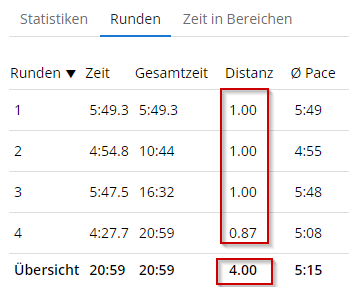
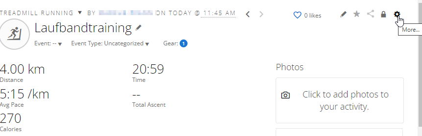
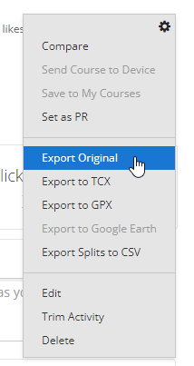
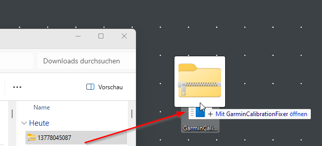
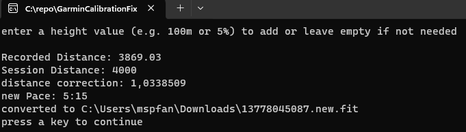
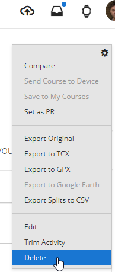

# GarminCalibrationFixer
fixes activity information for Garmin Connect when executing a treadmill calibration

when running on treadmill and it's not somehow smart and connected you can run an "calibration" after the activity. But correct only a few values for the run:

This tool checks differences and corrects the following values based on the difference of the values.
In the example distance 3.87 was measured by the watch, distance 4.00 was the value i've seen on my treadmill and entered it to calibration after the run.

Following Fields within the fit-file are adjusted:
-AccumulatedPower
-AvgPower
-AvgSpeed
-AvgStepLength
-Distance
-EnhancedAvgSpeed
-EnhancedMaxSpeed
-EnhancedSpeed
-MaxPower
-MaxSpeed
-NormalizedPower
-Power 
-StepLength
-TotalCalories
-TotalDistance
-TotalTrainingEffect
-TotalWork
-TrainingLoadPeak

## How To
in short -> download your session from garmin, process it with the tool, delete the session online and upload the modified file

1. Download
Open the details of your activity on the garmin page, click "more..."

and press "Export Original"

2. Process
Now process the activity file with this tool e.g. via Drag&Drop:

The tool will ask for optional height that should be talken into consideration by the adjustment.
You can enter eighter a value as percentage (e.g. 2%) or as total meters. 

after processing the impact of the change are displayed

3. delete original activity (again in the details screen)

4. upload 
again on the website find the "upload" icon

press "Import Data"

And select the import file or drag&drop

